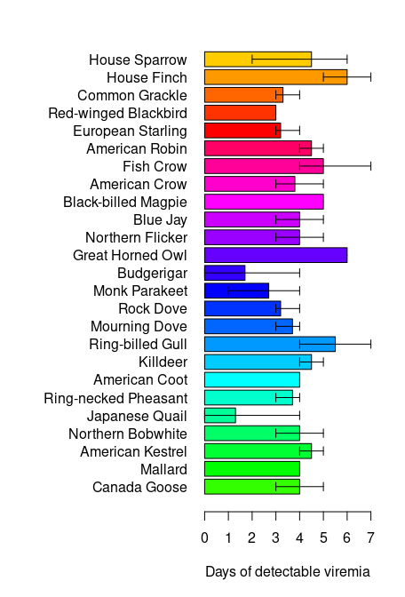

Warm-up mini-Report: Mosquito Blood Hosts in Salt Lake City, Utah
================
Lucien Patchett
2025-10-09

- [ABSTRACT](#abstract)
- [BACKGROUND](#background)
- [STUDY QUESTION and HYPOTHESIS](#study-question-and-hypothesis)
  - [Question](#question)
  - [Hypothesis](#hypothesis)
  - [Prediction](#prediction)
- [METHODS](#methods)
  - [Fill in 1st analysis
    e.g. barplots](#fill-in-1st-analysis-eg-barplots)
  - [Fill in 2nd analysis/plot e.g. generalized linear
    model](#fill-in-2nd-analysisplot-eg-generalized-linear-model)
- [DISCUSSION](#discussion)
  - [Interpretation of 1st analysis
    (e.g. barplots)](#interpretation-of-1st-analysis-eg-barplots)
  - [Interpretation of 2nd analysis (e.g. generalized linear
    model)](#interpretation-of-2nd-analysis-eg-generalized-linear-model)
- [CONCLUSION](#conclusion)
- [REFERENCES](#references)

# ABSTRACT

Analysis of blood meal taken from mosquitoes within the Salt Lake City,
UT area was performed to determine the what species were fed on and
whether or not they were positive for West Nile Virus (WNV). Further
testing indicated a correlation between House Finches and the positive
testing for West Nile Virus, demonstrating a preference for WNV to
select House Finch as a viable host for reproduction.

# BACKGROUND

The West Nile Virus (WNV) is a positive-sense, single stranded RNA virus
(+ssRNA) that was first isolated in Uganda in 1937 and has spread
throughout the world with typical outbreaks in June-October every year
(About West Nile). WNV typically uses birds as a reservoir and will is
transmitted to humans through a mosquito blood meal (Karim & Bai, 2023).
Because of this method of transmission researchers are able to sequence
mosquitoes in order to determine which animals the mosquitoes fed on and
whether or not there is WNV present in those DNA samples.

By identifying the species DNA and PCR, researchers are able to identify
species found within blood meals which allows for research into where
mosquitoes have been and their preferences for blood meal. This also
promotes further testing to learn about those specific species in from
their DNA sequences to find positive WNV hosts.

Below is a viremia plot showing how long WNV is found within the blood
stream of species found in mosquito samples, with the longest being
House Finches. This leads to speculation that House Finches may be the
most desirable host for WNV replication.

``` r
# Manually transcribe duration (mean, lo, hi) from the last table column
duration <- data.frame(
  Bird = c("Canada Goose","Mallard", 
           "American Kestrel","Northern Bobwhite",
           "Japanese Quail","Ring-necked Pheasant",
           "American Coot","Killdeer",
           "Ring-billed Gull","Mourning Dove",
           "Rock Dove","Monk Parakeet",
           "Budgerigar","Great Horned Owl",
           "Northern Flicker","Blue Jay",
           "Black-billed Magpie","American Crow",
           "Fish Crow","American Robin",
           "European Starling","Red-winged Blackbird",
           "Common Grackle","House Finch","House Sparrow"),
  mean = c(4.0,4.0,4.5,4.0,1.3,3.7,4.0,4.5,5.5,3.7,3.2,2.7,1.7,6.0,4.0,
           4.0,5.0,3.8,5.0,4.5,3.2,3.0,3.3,6.0,4.5),
  lo   = c(3,4,4,3,0,3,4,4,4,3,3,1,0,6,3,
           3,5,3,4,4,3,3,3,5,2),
  hi   = c(5,4,5,5,4,4,4,5,7,4,4,4,4,6,5,
           5,5,5,7,5,4,3,4,7,6)
)

# Choose some colors
cols <- c(rainbow(30)[c(10:29,1:5)])  # rainbow colors

# horizontal barplot
par(mar=c(5,12,2,2))  # wider left margin for names
bp <- barplot(duration$mean, horiz=TRUE, names.arg=duration$Bird,
              las=1, col=cols, xlab="Days of detectable viremia", xlim=c(0,7))

# add error bars
arrows(duration$lo, bp, duration$hi, bp,
       angle=90, code=3, length=0.05, col="black", xpd=TRUE)
```



# STUDY QUESTION and HYPOTHESIS

## Question

Which bird species acts as an amplifying host of WNV in Salt Lake City?

## Hypothesis

House Finches are the most viable host for WNV replication in the area
of mosquito collection.

## Prediction

Areas with House Finch populations with have a higher frequency of WNV
found in mosquito samples.

# METHODS

In the experiment we isolated mosquito DNA found in the Salt Lake City,
UT area and through the use of PCR amplified the samples. With this data
we could BLAST the samples and compare the number of blood meals in
species that were positive and negative for WNV. From there we were able
to examine whether the presence of House Finches in a pool had an effect
on the occurrence of WNV in that pool.

## Fill in 1st analysis e.g. barplots

The first analysis displays a comparison of the number of mosquito blood
meals from each species and displayed that number in both a positive or
negative bar plot for WNV. Using a bar plot for this analysis allows for
simple size comparisons to infer conclusions.

``` r
## import counts_matrix: data.frame with column 'loc_positives' (0/1) and host columns 'host_*'
counts_matrix <- read.csv("./bloodmeal_plusWNV_for_BIOL3070.csv")

## 1) Identify host columns
host_cols <- grep("^host_", names(counts_matrix), value = TRUE)

if (length(host_cols) == 0) {
  stop("No columns matching '^host_' were found in counts_matrix.")
}

## 2) Ensure loc_positives is present and has both levels 0 and 1 where possible
counts_matrix$loc_positives <- factor(counts_matrix$loc_positives, levels = c(0, 1))

## 3) Aggregate host counts by loc_positives
agg <- stats::aggregate(
  counts_matrix[, host_cols, drop = FALSE],
  by = list(loc_positives = counts_matrix$loc_positives),
  FUN = function(x) sum(as.numeric(x), na.rm = TRUE)
)

## make sure both rows exist; if one is missing, add a zero row
need_levels <- setdiff(levels(counts_matrix$loc_positives), as.character(agg$loc_positives))
if (length(need_levels)) {
  zero_row <- as.list(rep(0, length(host_cols)))
  names(zero_row) <- host_cols
  for (lv in need_levels) {
    agg <- rbind(agg, c(lv, zero_row))
  }
  ## restore proper type
  agg$loc_positives <- factor(agg$loc_positives, levels = c("0","1"))
  ## coerce numeric host cols (they may have become character after rbind)
  for (hc in host_cols) agg[[hc]] <- as.numeric(agg[[hc]])
  agg <- agg[order(agg$loc_positives), , drop = FALSE]
}

## 4) Decide species order (overall abundance, descending)
overall <- colSums(agg[, host_cols, drop = FALSE], na.rm = TRUE)
host_order <- names(sort(overall, decreasing = TRUE))
species_labels <- rev(sub("^host_", "", host_order))  # nicer labels

## 5) Build count vectors for each panel in the SAME order
counts0 <- rev(as.numeric(agg[agg$loc_positives == 0, host_order, drop = TRUE]))
counts1 <- rev(as.numeric(agg[agg$loc_positives == 1, host_order, drop = TRUE]))

## 6) Colors: reuse your existing 'cols' if it exists and is long enough; otherwise generate
if (exists("cols") && length(cols) >= length(host_order)) {
  species_colors <- setNames(cols[seq_along(host_order)], species_labels)
} else {
  species_colors <- setNames(rainbow(length(host_order) + 10)[seq_along(host_order)], species_labels)
}

## 7) Shared x-limit for comparability
xmax <- max(c(counts0, counts1), na.rm = TRUE)
xmax <- if (is.finite(xmax)) xmax else 1
xlim_use <- c(0, xmax * 1.08)

## 8) Plot: two horizontal barplots with identical order and colors
op <- par(mfrow = c(1, 2),
          mar = c(4, 12, 3, 2),  # big left margin for species names
          xaxs = "i")           # a bit tighter axis padding

## Panel A: No WNV detected (loc_positives = 0)
barplot(height = counts0,
        names.arg = species_labels, 
        cex.names = .5,
        cex.axis = .5,
        col = rev(unname(species_colors[species_labels])),
        horiz = TRUE,
        las = 1,
        xlab = "Bloodmeal counts",
        main = "Locations WNV (-)",
        xlim = xlim_use)

## Panel B: WNV detected (loc_positives = 1)
barplot(height = counts1,
        names.arg = species_labels, 
        cex.names = .5,
        cex.axis = .5,
        col = rev(unname(species_colors[species_labels])),
        horiz = TRUE,
        las = 1,
        xlab = "Bloodmeal counts",
        main = "Locations WNV (+)",
        xlim = xlim_use)
```

<!-- -->

``` r
par(op)

## Keep the colors mapping for reuse elsewhere
host_species_colors <- species_colors
```

## Fill in 2nd analysis/plot e.g. generalized linear model

The second analysis displays the presence of WNV (binary) and the
numeric outcome of WNV (WNV positivity rate). Comparison of these two
data sets allows for evaluation of the relationship of species and WNV
occurrence found in the bar plots of the first analysis.

``` r
# second-analysis-or-plot, glm with house finch alone against binary +/_
glm1 <- glm(loc_positives ~ host_House_finch,
            data = counts_matrix,
            family = binomial)
summary(glm1)
```

    ## 
    ## Call:
    ## glm(formula = loc_positives ~ host_House_finch, family = binomial, 
    ##     data = counts_matrix)
    ## 
    ## Coefficients:
    ##                  Estimate Std. Error z value Pr(>|z|)  
    ## (Intercept)       -0.1709     0.1053  -1.622   0.1047  
    ## host_House_finch   0.3468     0.1586   2.187   0.0287 *
    ## ---
    ## Signif. codes:  0 '***' 0.001 '**' 0.01 '*' 0.05 '.' 0.1 ' ' 1
    ## 
    ## (Dispersion parameter for binomial family taken to be 1)
    ## 
    ##     Null deviance: 546.67  on 394  degrees of freedom
    ## Residual deviance: 539.69  on 393  degrees of freedom
    ## AIC: 543.69
    ## 
    ## Number of Fisher Scoring iterations: 4

``` r
#glm with house-finch alone against positivity rate
glm2 <- glm(loc_rate ~ host_House_finch,
            data = counts_matrix)
summary(glm2)
```

    ## 
    ## Call:
    ## glm(formula = loc_rate ~ host_House_finch, data = counts_matrix)
    ## 
    ## Coefficients:
    ##                  Estimate Std. Error t value Pr(>|t|)    
    ## (Intercept)      0.054861   0.006755   8.122 6.07e-15 ***
    ## host_House_finch 0.027479   0.006662   4.125 4.54e-05 ***
    ## ---
    ## Signif. codes:  0 '***' 0.001 '**' 0.01 '*' 0.05 '.' 0.1 ' ' 1
    ## 
    ## (Dispersion parameter for gaussian family taken to be 0.01689032)
    ## 
    ##     Null deviance: 6.8915  on 392  degrees of freedom
    ## Residual deviance: 6.6041  on 391  degrees of freedom
    ##   (2 observations deleted due to missingness)
    ## AIC: -484.56
    ## 
    ## Number of Fisher Scoring iterations: 2

# DISCUSSION

## Interpretation of 1st analysis (e.g. barplots)

The results of our first analysis displayed the occurrences of different
species blood found in a mosquito collection and whether or not those
samples were positive for WNV. We found that not only were House finches
the most common animal found in the mosquitoes but they also made up a
larger proportion of WNV positive samples as compared to others tested.
This indicates that House Finches could be among the higher hosts for
this virus in the pools which mosquitoes were collected from, along with
being a more desirable source for blood meal from mosquitoes.

## Interpretation of 2nd analysis (e.g. generalized linear model)

We found in the second analysis a high correlation between the House
Finch species and occurrence of WNV. This is indicated by the low
p-values (0.0287 and 0.000454) that were found in the analysis. With
these results we are able to reject the null of no correlation between
species and WNV, supporting our Hypothesis that there House Finches may
be the most viable host for WNV replication.

# CONCLUSION

In conclusion to answer the question stated at the beginning, the House
Finch is the most effective WNV amplifying species that was found in
mosquito blood meal from the Salt Lake City area. This is supported by
how strongly correlated the Finches presence in blood meal is to it
containing the virus. Further testing is suggested by analyzing blood
meal and running similar tests on mosquitoes in various pools throughout
the world to see if similar species follow suit.

# REFERENCES

1.  Centers for Disease Control and Prevention. (n.d.). About West Nile.
    Centers for Disease Control and Prevention.
    <https://www.cdc.gov/west-nile-virus/about/index.html>

2.  Karim, S.-U., & Bai, F. (2023). Introduction to west nile virus.
    Methods in molecular biology (Clifton, N.J.).
    <https://pmc.ncbi.nlm.nih.gov/articles/PMC10719965/>

3.  OpenAI. (2025, October 8). ChatGPT (GPT-5) \[Large language model\].
    <https://chat.openai.com/> (used for paper editing)
